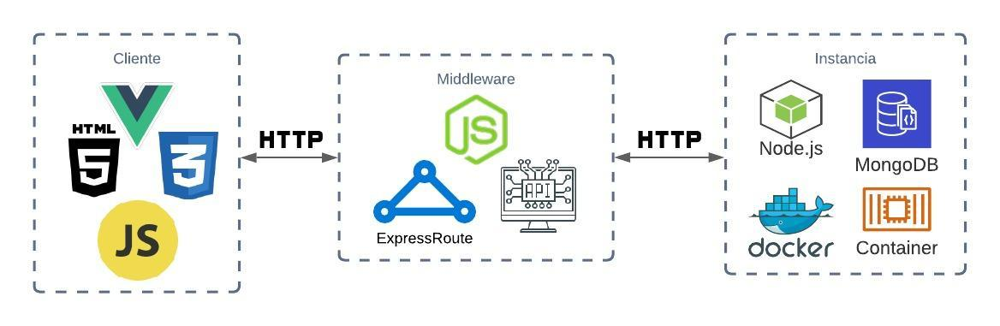

# Laboratorio 3 Sistemas Distribuidos

### Enunciado
Crear un sistema que permita guardar registros en una BD en mongo pasando por un middleware, cada cierto tiempo hacer un backup en un servidor externo, tener un servicio de monitoreo constante(latidos) cuando el server dure 5s sin responder, crear una nueva instancia del servicio con la BD restaurada y el codigo corriendo (obtenida del servidor de backup), en el middleware actualizar la ip del nuevo servidor.

### Arquitectura


### Dependencias
#### Middleware
```
"axios": "^0.21.1",
"express": "^4.17.1",
"nodemon": "^2.0.7"
```
#### Instancia contenedor Docker
```
"express": "^4.17.1",
"mongodb": "^3.6.4",
"nodemon": "^2.0.7"
```

## Integrantes
- [Mati Rodriguez](https://github.com/limarosa29)
- [Christian Chamorro](https://github.com/cris201497https://github.com/limarosa291130)
- [Oscar Rojas](https://github.com/augusticor)
